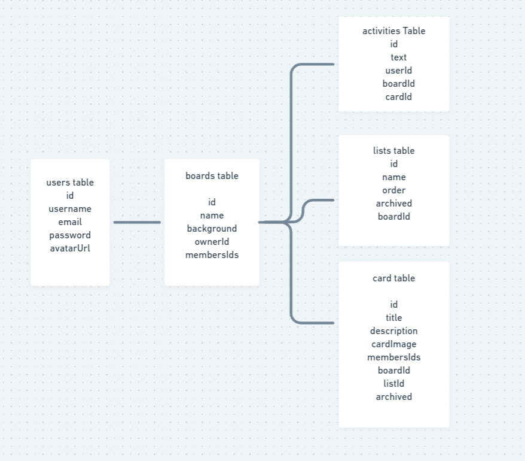

# Trello clone ([Visit Now](https://clone-trello.now.sh))

        

```

💎 Trello is a web-based Kanban-style list-making application and this projects clones it down,
adding most of the features which can give a user to add some kanban to their projects idea.
```

### Peek a Boo!


### ER Diagram



### Run server

```
cd server && npm run dev
```

### Run client

```
yarn start
```

### Wanna Clone it ?

- git clone {this repo}
- create a mongodb Atlas Cluster and get connection uri
- make sure you have two now secrets

  - mongo_uri = "connection uri with user and password"
  - jwtsecretkey="random string"

- add a .env file and add same two secrets like .env.sample file so work in development mode.
- deploy / Redeploy

### Redeploy

- make changes
- make sure you have two now secrets

  - mongo_uri
  - jwtsecretkey

- now
- now alias https://trello-clone.jugshaurya.now.sh clone-trello.now.sh

#### UI/UX -DESIGN

- linear-gradient(135deg, #0079bf, #5067c5)
- background-color: #0079bf;
- box-shadow: 0 0 10px rgba(0, 0, 0, 0.3);

#### Progress

- [x] Generate Server
  - [x] node + express
  - [x] mongodb connection + mongoose
    - [x] trello-clone db
      - [x] users collection
  - [x] auth - local SignIn using Passport
  - [x] jwt
  - [x] bcrypt to hash pass
- [x] Generate Client
  - [x] Create a react app
  - [x] use react-bootstrap/ant design or write from scratch
  - [x] Add redux-logger
  - [x] Add redux-thunk
- [x] Add local auth to server
- [ ] TODO: Add client data validation on server use JOI
- [ ] Add signin and signup to client
  - [x] Create Form for Both
  - [ ] Add Client Side Validation of data @server, checking and showing errors: use joi
  - [x] save token after signin inside localstorage
- [x] Add boards service to server
- [x] User can create/view boards on client
  - [x] Create new Board
    - [x] Add ownerId
  - [x] View all the boards
    - [x] show user's boards not of others
- [x] view single board using id param to route
  - [x] @server : add GET /boards/id=3027593 route and route handler
- [ ] User can create/view lists for boards
  - [x] @server
    - [x] create new list in board, POST : /lists/:boardId
    - [x] get all , GET: /lists/:boardId
  - [x] @client : create board Component
    - [x] get all lists in a board
    - [x] create new list
  - [ ] Restrict only the owner to create a new list
- [x] create/view cards in list
  - [x] @client
  - [x] @server : service to server
- [x] Drag Cards from one list to another
  - [x] Options: (https://github.com/mzabriskie/react-draggable) or
        (https://developer.mozilla.org/en-US/docs/Web/API/HTML_Drag_and_Drop_API) or
        (http://jsfiddle.net/zfnj5rv4/) or (https://www.npmjs.com/package/react-draggable-list)
- [x] make logged in user visible on navbar
- [x] user can edit the card
- [x] User can add image/attachment to a card (https://codeburst.io/image-uploading-using-react-and-node-to-get-the-images-up-c46ec11a7129).
- [x] npm multer
- [x] Add redux and create basic store files
- [x] Create activities service on server
- [x] All activities are logged
  - [x] dragging card activity
  - [x] creating card activity
  - [x] create list activity
  - [x] card Update Activity
    - [x] card title change
    - [x] card photo change
    - [x] card descritption change
- [x] user can add description to card
- [x] Style refactor
- [x] Delete Board
- [x] Delete List
- [x] Show all the available boards on a specific board so it is easy to switch b/w boards
- [x] Deploy front end and backend

#### Stretch

- [ ] Add funtionality to boards to mark them favorites
  - [ ] show all fav boards under fav sections

* [ ] Restrict only the board owner to
  - [x] Access his/her boards only
  - [ ] create a list or create a card
* [ ] User can add other members to a board
* [ ] Update restrict to board owner to include members
* [ ] User can re-arrange lists
* [ ] restrict to board members
* [ ] User can assign a member to a card
* [ ] restrict to board members
* [ ] User can add comments to a card
* [ ] restrict to board members

- [ ] Add Socket-io for real time board sharing
- [ ] Arrange Lists and card and change order
- [ ] Archieve Cards and Lists

#### Thank you Links

- https://blog.logrocket.com/how-to-use-bootstrap-with-react-a354715d1121/
- https://fonts.google.com/?selection.family=PT+Sans
- https://getbootstrap.com/docs/4.4/layout/overview/
- https://vectr.com/new
- https://digitalsynopsis.com/design/beautiful-color-ui-gradients-backgrounds/
- https://blog.bitsrc.io/react-production-deployment-part-2-now-c81657c700b7
- https://zeit.co/guides/deploying-a-mongodb-powered-api-with-node-and-now

#### Special Thanks to Coding Gardan CJ for the project idea

```
he used Featherjs and Vue to made the same but I am going to make it in React and backend from scratch, will be

taking the pointers about what to implement and using his entity relationship Diagram to make my database structure.
```
